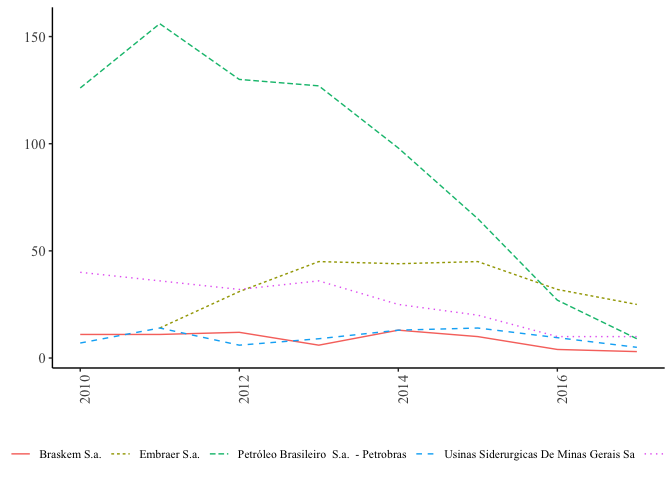
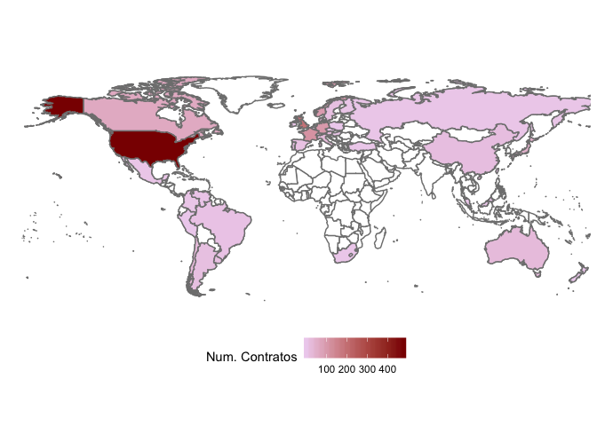

Transferencia de Tecnologia INPI
================

## Empresas e contratos

``` r
tab <- df.geral %>%
  count(e_cedentes, e_cessionaria)

tab[,1] <- c("Sem contratos", "Com contrato como cessionaria", "Com contrato como cedente", "Com contrato como cessionaria e cedente")

tab <- tab[,-2]

colnames(tab) <- c("Situacao", "Numero de Empresas")

tab <- tab %>%
  adorn_totals("row") %>%
  adorn_percentages("col") %>%
  adorn_pct_formatting(affix_sign = FALSE) %>%
  adorn_ns(position = "front") %>%
  as.data.frame()


knitr::kable(tab)
```

| Situacao                                | Numero de Empresas |
| :-------------------------------------- | :----------------- |
| Sem contratos                           | 411 (90.7)         |
| Com contrato como cessionaria           | 29 (6.4)           |
| Com contrato como cedente               | 10 (2.2)           |
| Com contrato como cessionaria e cedente | 3 (0.7)            |
| Total                                   | 453 (100.0)        |

## As dez principais empresas cedentes e cessionarias

### Empresas Cedente

``` r
tab <- df.cedentes %>%
  group_by(name_company) %>%
  mutate( n =1 )%>%
  summarise_at(vars(transferencia:licensa:cessao:n), sum) %>%
  arrange(desc(n)) %>%
  select(name_company, n, everything()) %>%
  mutate(setor = df.cedentes$setor_b3[match(name_company, df.cedentes$name_company)]) %>%
  select(name_company, setor, everything())  %>%
  mutate(id = 1:length(n))
```

    ## Warning in x:y: numerical expression has 2 elements: only the first used

    ## Warning in x:y: numerical expression has 3 elements: only the first used

``` r
df.cedentes %>%
  group_by(name_company) %>%
  count(pais_da_cessionaria)
```

    ## # A tibble: 20 x 3
    ## # Groups:   name_company [15]
    ##    name_company                                  pais_da_cessionaria     n
    ##    <chr>                                         <chr>               <int>
    ##  1 BANCO DO BRASIL S.A.                           BRASIL(DF)             1
    ##  2 BANCO DO BRASIL S.A.                           BRASIL(RJ)             1
    ##  3 BANCO DO BRASIL S.A.                           BRASIL(SP)             3
    ##  4 BRF S.A.                                       BRASIL(PR)             1
    ##  5 COMPANHIA BRASILEIRA DE DISTRIBUIÇÃO           BRASIL(RJ)             1
    ##  6 COMPANHIA BRASILEIRA DE DISTRIBUIÇÃO           BRASIL(SP)             2
    ##  7 ETERNIT S.A.- EM RECUPERAÇÃO JUDICIAL          BRASIL(CE)             1
    ##  8 IGB ELETRÔNICA S.A. - EM RECUPERAÇÃO JUDICIAL  BRASIL(AM)             1
    ##  9 IGB ELETRÔNICA S.A. - EM RECUPERAÇÃO JUDICIAL  BRASIL(BA)             1
    ## 10 ITAUTEC S.A. - GRUPO ITAUTEC                   BRASIL(RS)             1
    ## 11 ITAUTEC S.A. - GRUPO ITAUTEC                   BRASIL(SP)             1
    ## 12 KEPLER WEBER SA                                BRASIL(RS)             2
    ## 13 NATURA COSMETICOS SA                           BRASIL(SP)             1
    ## 14 OI S.A. - EM RECUPERAÇÃO JUDICIAL              BRASIL(SP)             1
    ## 15 OURO FINO SAÚDE ANIMAL PARTICIPAÇÕES S.A.      BRASIL(SP)             1
    ## 16 PETRÓLEO BRASILEIRO  S.A.  - PETROBRAS         BRASIL(RN)             2
    ## 17 QUALICORP SA                                   BRASIL(SP)             1
    ## 18 TELEFÔNICA BRASIL S.A.                         BRASIL(SP)             2
    ## 19 UNICASA INDÚSTRIA DE MÓVEIS S.A.               BRASIL(RS)             1
    ## 20 VIA VAREJO S.A.                                BRASIL(SP)             1

``` r
outros <- tab %>%
  filter(id>10) %>%
  summarise_if(is.numeric, sum)  %>%
  mutate(name_company = "Outros") %>%
  mutate(setor = "Outros") %>%
  select(name_company, setor, everything())


tab <- tab %>%
  filter(id<11) 

tab <- rbind(tab, outros) %>%
  select(-id) %>%
  mutate(name_company = str_to_title(name_company))

tab <- tab %>%
  adorn_totals("row") %>%
  adorn_percentages("col") %>%
  adorn_pct_formatting(affix_sign = FALSE) %>%
  adorn_ns(position = "front") %>%
  as.data.frame()


knitr::kable(tab)
```

| name\_company                                 | setor                                                             | n          | transferencia | licensa    | cessao |
| :-------------------------------------------- | :---------------------------------------------------------------- | :--------- | :------------ | :--------- | :----- |
| Banco Do Brasil S.a.                          | Financeiro (Financeiro)                                           | 5 (19.2)   | 0 (-)         | 5 (19.2)   | 0 (-)  |
| Companhia Brasileira De Distribuição          | Consumo não Cíclico (Consumo não Cíclico)                         | 3 (11.5)   | 0 (-)         | 3 (11.5)   | 0 (-)  |
| Igb Eletrônica S.a. - Em Recuperação Judicial | Financeiro (Financeiro)                                           | 2 (7.7)    | 0 (-)         | 2 (7.7)    | 0 (-)  |
| Itautec S.a. - Grupo Itautec                  | Tecnologia da Informação (Tecnologia da Informação)               | 2 (7.7)    | 0 (-)         | 2 (7.7)    | 0 (-)  |
| Kepler Weber Sa                               | Bens Industriais (Bens Industriais)                               | 2 (7.7)    | 0 (-)         | 2 (7.7)    | 0 (-)  |
| Petróleo Brasileiro S.a. - Petrobras          | Petróleo. Gás e Biocombustíveis (Petróleo. Gás e Biocombustíveis) | 2 (7.7)    | 0 (-)         | 2 (7.7)    | 0 (-)  |
| Telefônica Brasil S.a.                        | Telecomunicações (Telecomunicações)                               | 2 (7.7)    | 0 (-)         | 2 (7.7)    | 0 (-)  |
| Brf S.a.                                      | Consumo não Cíclico (Consumo não Cíclico)                         | 1 (3.8)    | 0 (-)         | 1 (3.8)    | 0 (-)  |
| Eternit S.a.- Em Recuperação Judicial         | Bens Industriais (Bens Industriais)                               | 1 (3.8)    | 0 (-)         | 1 (3.8)    | 0 (-)  |
| Natura Cosmeticos Sa                          | Consumo não Cíclico (Consumo não Cíclico)                         | 1 (3.8)    | 0 (-)         | 1 (3.8)    | 0 (-)  |
| Outros                                        | Outros (Outros)                                                   | 5 (19.2)   | 0 (-)         | 5 (19.2)   | 0 (-)  |
| Total                                         | \- (-)                                                            | 26 (100.0) | 0 (-)         | 26 (100.0) | 0 (-)  |

### Empresas Cessionárias

``` r
tab <- df.cessionarias %>%
  group_by(name_company) %>%
  mutate( n =1 )%>%
  summarise_at(vars(transferencia:licensa:cessao:n), sum) %>%
  arrange(desc(n)) %>%
  select(name_company, n, everything()) %>%
  mutate(setor = df.cessionarias$setor_b3[match(name_company, df.cessionarias$name_company)]) %>%
  select(name_company, setor, everything())  %>%
  mutate(id = 1:length(n))
```

    ## Warning in x:y: numerical expression has 2 elements: only the first used

    ## Warning in x:y: numerical expression has 3 elements: only the first used

``` r
outros <- tab %>%
  filter(id>10) %>%
  summarise_if(is.numeric, sum)  %>%
  mutate(name_company = "Outros") %>%
  mutate(setor = "Outros") %>%
  select(name_company, setor, everything())


tab <- tab %>%
  filter(id<11) 

tab <- rbind(tab, outros) %>%
  select(-id) %>%
  mutate(name_company = str_to_title(name_company))

tab <- tab %>%
  adorn_totals("row") %>%
  adorn_percentages("col") %>%
  adorn_pct_formatting(affix_sign = FALSE) %>%
  adorn_ns(position = "front") %>%
  as.data.frame()


knitr::kable(tab)
```

| name\_company                          | setor                                                             | n            | transferencia | licensa    | cessao    |
| :------------------------------------- | :---------------------------------------------------------------- | :----------- | :------------ | :--------- | :-------- |
| Petróleo Brasileiro S.a. - Petrobras   | Petróleo. Gás e Biocombustíveis (Petróleo. Gás e Biocombustíveis) | 738 (50.5)   | 736 (51.5)    | 4 (10.3)   | 0 (0.0)   |
| Embraer S.a.                           | Bens Industriais (Bens Industriais)                               | 236 (16.2)   | 236 (16.5)    | 0 (0.0)    | 0 (0.0)   |
| Vale S.a.                              | Materiais Básicos (Materiais Básicos)                             | 209 (14.3)   | 209 (14.6)    | 0 (0.0)    | 0 (0.0)   |
| Braskem S.a.                           | Materiais Básicos (Materiais Básicos)                             | 70 (4.8)     | 69 (4.8)      | 3 (7.7)    | 0 (0.0)   |
| Usinas Siderurgicas De Minas Gerais Sa | Materiais Básicos (Materiais Básicos)                             | 68 (4.7)     | 68 (4.8)      | 0 (0.0)    | 0 (0.0)   |
| Cia Siderurgica Nacional               | Materiais Básicos (Materiais Básicos)                             | 26 (1.8)     | 26 (1.8)      | 0 (0.0)    | 0 (0.0)   |
| Mahle Metal Leve S.a.                  | Consumo Cíclico (Consumo Cíclico)                                 | 14 (1.0)     | 13 (0.9)      | 1 (2.6)    | 0 (0.0)   |
| Fibria Celulose S.a.                   | Materiais Básicos (Materiais Básicos)                             | 13 (0.9)     | 13 (0.9)      | 1 (2.6)    | 0 (0.0)   |
| Gerdau S.a.                            | Materiais Básicos (Materiais Básicos)                             | 9 (0.6)      | 9 (0.6)       | 0 (0.0)    | 0 (0.0)   |
| Hypera S/A                             | Saúde (Saúde)                                                     | 7 (0.5)      | 0 (0.0)       | 7 (17.9)   | 2 (100.0) |
| Outros                                 | Outros (Outros)                                                   | 71 (4.9)     | 51 (3.6)      | 23 (59.0)  | 0 (0.0)   |
| Total                                  | \- (-)                                                            | 1461 (100.0) | 1430 (100.0)  | 39 (100.0) | 2 (100.0) |

## Distribuicao dos contratos de transferencia por setor e ano

``` r
dados <-df.cessionarias %>%
  group_by(name_company, ano , add = TRUE) %>%
  count() 

tmp <- dados %>%
  group_by(ano) %>%
  summarise(n = sum(n)) %>%
  mutate(name_company = "Total")

dados <- full_join(dados, tmp) %>%
  ungroup(name_company) %>%
  mutate(name_company = str_to_title(name_company)) %>%
  filter(name_company %in% tab$name_company[c(1:5)])
```

    ## Joining, by = c("name_company", "ano", "n")

``` r
ggplot(data = dados, mapping = aes(x = ano, y=n)) +
  geom_line(aes(color = name_company, linetype = name_company)) +theme_classic() +  theme(axis.text.x = element_text(angle=90, hjust=1), text=element_text(family="Times New Roman", size=11), axis.text = element_text(family="Times New Roman", size=11))   +
  xlab(" ") + ylab(" ") +   theme(legend.title=element_blank()) +
  theme(legend.position="bottom")
```

<!-- -->

### Categoria dos contratos de tecnologia firmados pelas empresas da B3 por setores

``` r
tab <- df.cessionarias %>%
  group_by(setor_b3) %>%
  summarise_at(vars(transferencia:licensa:cessao), sum)
```

    ## Warning in x:y: numerical expression has 2 elements: only the first used

``` r
tab <- tab %>%
  adorn_totals("row") %>%
  adorn_percentages("all") %>%
  adorn_pct_formatting(affix_sign = FALSE) %>%
  adorn_ns(position = "front") %>%
  as.data.frame()

knitr::kable(tab)
```

| setor\_b3                       | transferencia | licensa  | cessao  |
| :------------------------------ | :------------ | :------- | :------ |
| Bens Industriais                | 249 (16.9)    | 1 (0.1)  | 0 (0.0) |
| Consumo Cíclico                 | 26 (1.8)      | 14 (1.0) | 0 (0.0) |
| Consumo não Cíclico             | 5 (0.3)       | 4 (0.3)  | 0 (0.0) |
| Financeiro                      | 3 (0.2)       | 1 (0.1)  | 0 (0.0) |
| Materiais Básicos               | 405 (27.5)    | 4 (0.3)  | 0 (0.0) |
| Petróleo. Gás e Biocombustíveis | 739 (50.2)    | 4 (0.3)  | 0 (0.0) |
| Saúde                           | 0 (0.0)       | 8 (0.5)  | 2 (0.1) |
| Tecnologia da Informação        | 0 (0.0)       | 1 (0.1)  | 0 (0.0) |
| Telecomunicações                | 1 (0.1)       | 2 (0.1)  | 0 (0.0) |
| Utilidade Pública               | 2 (0.1)       | 0 (0.0)  | 0 (0.0) |
| Total                           | 1430 (97.2)   | 39 (2.7) | 2 (0.1) |

### Paises forncedores de tecnologia por meio de contrato

``` r
aux <- df.cessionarias %>%
  count(pais_da_cedente)

aux$pais_da_cedente
```

    ##  [1] "AFRICA DO SUL"    "ALEMANHA"         "ARGENTINA"       
    ##  [4] "AUSTRÁLIA"        "AUSTRIA"          "BÉLGICA"         
    ##  [7] "BRASIL"           "CANADÁ"           "CHILE"           
    ## [10] "CHINA"            "CINGAPURA"        "COLÔMBIA"        
    ## [13] "COREIA"           "DINAMARCA"        "ESPANHA"         
    ## [16] "ESTADOS UNIDOS"   "FINLÂNDIA"        "FRANÇA"          
    ## [19] "HOLANDA"          "HUNGRIA"          "IRLANDA"         
    ## [22] "ISRAEL"           "ITÁLIA"           "JAPÃO"           
    ## [25] "MALÁSIA"          "MAURÍCIO"         "MÉXICO"          
    ## [28] "NORUEGA"          "NOVA ZELÂNDIA"    "PERU"            
    ## [31] "POLONIA"          "PORTUGAL"         "REINO UNIDO"     
    ## [34] "REPÚBLICA TCHECA" "RUSSIA"           "SUÉCIA"          
    ## [37] "SUIÇA"            "TAIWAN"           "TURQUIA"         
    ## [40] "UCRÂNIA"          "URUGUAI"          "VENEZUELA"

``` r
paises <- 
c("SOUTH AFRICA", "GERMANY", "ARGENTINA", "AUSTRALIA", "AUSTRIA",
"BELGIUM", "BRAZIL", "CANADA", "CHILE", "CHINA", "SINGAPORE", "COLOMBIA", "KOREA", "DENMARK", "SPAIN",
"USA", "FINLAND", "FRANCE", "HOLLAND", "HUNGARY",
"IRELAND", "ISRAEL", "ITALY", "JAPAN", "MALAYSIA",
"MAURITIUS", "MEXICO", "NORWAY", "NEW ZEALAND", "PERU",
"POLAND", "PORTUGAL", "UK", "CZECH REPUBLIC", "RUSSIA",
"SWEDEN", "SWITZERLAND", "TAIWAN", "TURKEY", "UKRAINE",
"URUGUAY", "VENEZUELA")


paises <- str_to_title(paises)
paises <- str_replace(paises, "Usa", "USA")
paises <- str_replace(paises, "Uk", "UK")


WorldData <- map_data('world')
WorldData %>% filter(region != "Antarctica") -> WorldData
WorldData <- fortify(WorldData)

df <- data.frame(region=paises, 
                 value=aux$n, 
                 stringsAsFactors=FALSE)

p <- ggplot()
p <- p + geom_map(data=WorldData, map=WorldData,
                  aes(x=long, y=lat, group=group, map_id=region),
                  fill="white", colour="#7f7f7f", size=0.5)
```

    ## Warning: Ignoring unknown aesthetics: x, y

``` r
p <- p + geom_map(data=df, map=WorldData,
                  aes(fill=value, map_id=region),
                  colour="#7f7f7f", size=0.5)
p <- p + coord_map("rectangular", lat0=0, xlim=c(-180,180), ylim=c(-60, 90))
p <- p + scale_fill_continuous(low="thistle2", high="darkred",
                               guide="colorbar")
p <- p + scale_y_continuous(breaks=c())
p <- p + scale_x_continuous(breaks=c())
p <- p + labs(fill="Num. Contratos", title="", x="", y="")
p <- p + theme_bw()
p <- p + theme(panel.border = element_blank()) + theme(legend.position="bottom")
p 
```

<!-- -->

``` r
tab <- df.cessionarias %>%
  group_by(pais_da_cedente) %>%
  mutate( n =1 )%>%
  summarise_at(vars(transferencia:licensa:cessao:n), sum) %>%
  arrange(desc(n)) %>%
  select(pais_da_cedente, n, everything()) %>%
  mutate(id = 1:length(n))
```

    ## Warning in x:y: numerical expression has 2 elements: only the first used

    ## Warning in x:y: numerical expression has 3 elements: only the first used

``` r
outros <- tab %>%
  filter(id>9) %>%
  summarise_if(is.numeric, sum)  %>%
  mutate(pais_da_cedente = "Outros") %>%
  select(pais_da_cedente, everything())

 tab %>%
  filter(pais_da_cedente == "BRASIL")
```

    ## # A tibble: 1 x 6
    ##   pais_da_cedente     n transferencia licensa cessao    id
    ##   <chr>           <dbl>         <dbl>   <dbl>  <dbl> <int>
    ## 1 BRASIL             10             2       8      0    22

``` r
tab <- tab %>%
  filter(id<10) 


tab <- rbind(tab, outros) %>%
  select(-id) %>%
  mutate(pais_da_cedente = str_to_title(pais_da_cedente))


tab <- tab %>%
  adorn_percentages("col") %>%
  adorn_totals("row") %>%
  adorn_pct_formatting(affix_sign = FALSE) %>%
  adorn_ns(position = "front") %>%
  as.data.frame()


knitr::kable(tab)
```

| pais\_da\_cedente | n            | transferencia | licensa    | cessao    |
| :---------------- | :----------- | :------------ | :--------- | :-------- |
| Estados Unidos    | 478 (32.7)   | 467 (32.7)    | 15 (38.5)  | 2 (100.0) |
| Reino Unido       | 189 (12.9)   | 188 (13.1)    | 1 (2.6)    | 0 (0.0)   |
| França            | 114 (7.8)    | 112 (7.8)     | 2 (5.1)    | 0 (0.0)   |
| Alemanha          | 98 (6.7)     | 97 (6.8)      | 1 (2.6)    | 0 (0.0)   |
| Holanda           | 92 (6.3)     | 91 (6.4)      | 1 (2.6)    | 0 (0.0)   |
| Noruega           | 92 (6.3)     | 92 (6.4)      | 0 (0.0)    | 0 (0.0)   |
| Canadá            | 63 (4.3)     | 62 (4.3)      | 2 (5.1)    | 0 (0.0)   |
| Japão             | 46 (3.1)     | 45 (3.1)      | 1 (2.6)    | 0 (0.0)   |
| Austrália         | 25 (1.7)     | 25 (1.7)      | 0 (0.0)    | 0 (0.0)   |
| Outros            | 264 (18.1)   | 251 (17.6)    | 16 (41.0)  | 0 (0.0)   |
| Total             | 1461 (100.0) | 1430 (100.0)  | 39 (100.0) | 2 (100.0) |
